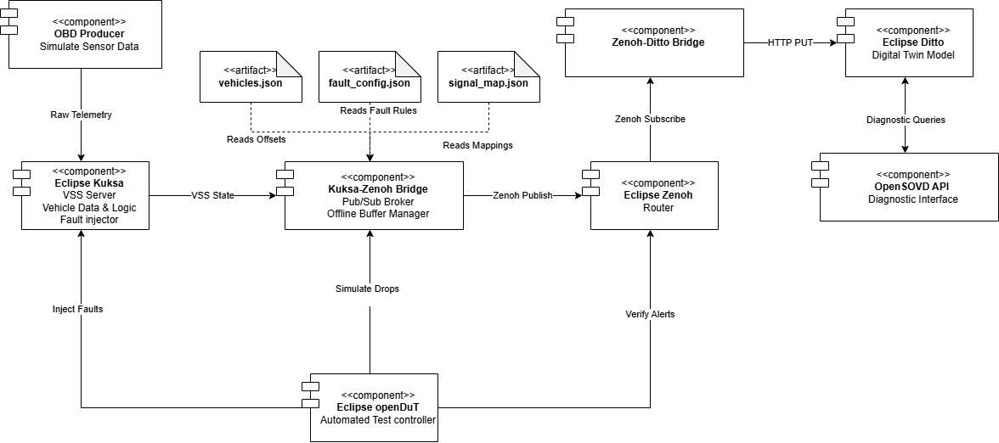
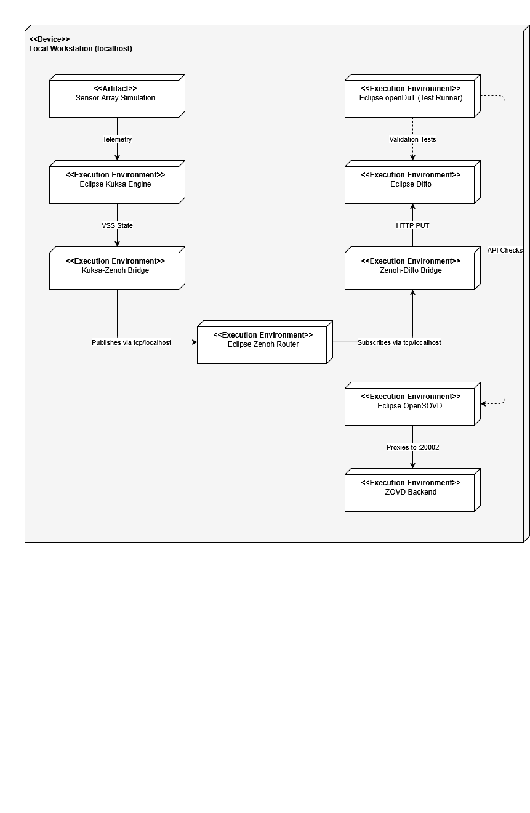
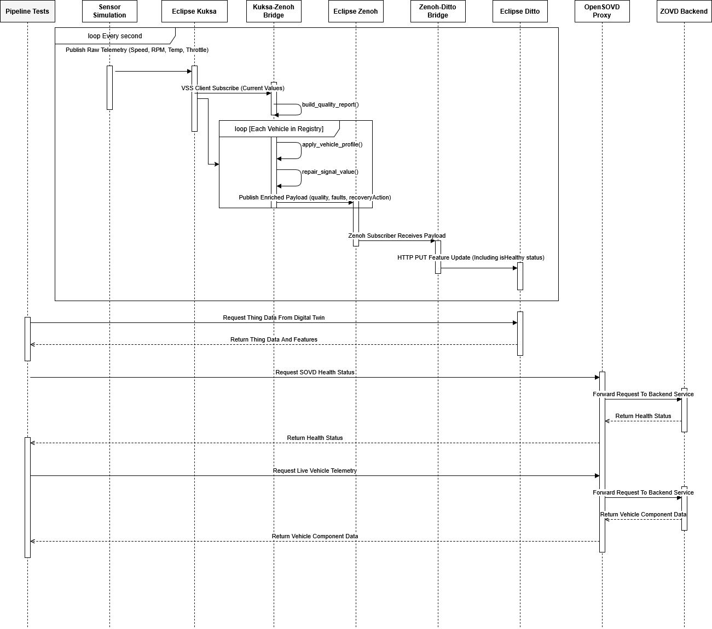

# SQ-PM-proj

This repository is currently focused on one milestone: bridging live OBD data from Kuksa Databroker into Eclipse Ditto using Eclipse Zenoh.

## Current Scope

`connect_kuksa_zenoh.py` and `subscribe_ditto_zenoh.py` work together to do four things:

1. Connect to Kuksa Databroker over gRPC.
2. Subscribe to configured OBD signals and route them through Zenoh.
3. Map each Kuksa signal to a Ditto feature name.
4. Update the matching Ditto features via the REST API.

`send_obd_data_to_kuksa.py` is an optional local test producer. It publishes random OBD values into Kuksa so the bridge has live data to forward to Ditto.

The active Kuksa to Ditto mapping lives in [config/signal_map.json](config/signal_map.json).

## Expected Signals

The bridge is currently configured for these Kuksa OBD paths:

- `Vehicle.OBD.VehicleSpeed`
- `Vehicle.OBD.EngineSpeed`
- `Vehicle.OBD.FuelLevel`
- `Vehicle.OBD.BatteryVoltage`
- `Vehicle.OBD.ThrottlePosition`
- `Vehicle.OBD.CoolantTemperature`

These map to Ditto feature IDs:

- `VehicleSpeed`
- `EngineSpeed`
- `FuelLevel`
- `BatteryVoltage`
- `ThrottlePosition`
- `CoolantTemperature`

## Requirements

- Python 3.13 recommended
- Docker Desktop installed and running
- A Python virtual environment in this repo (`venv` or `.venv`)
- Official component repos or startup locations available on the same machine:
  - Ditto: `C:\Users\Carson\ditto`
  - Kuksa Databroker: `C:\Users\Carson\kuksa-databroker`
  - OpenSOVD Classic Diagnostic Adapter: `C:\Users\Carson\classic-diagnostic-adapter`
  - OpenDuT compose setup: [opendut-docker](opendut-docker)
- A running Eclipse Zenoh router
- A Ditto policy and Thing that match the configured Thing ID and features

The current pipeline is intended to run against official external component stacks, not the root [docker-compose.yml](docker-compose.yml) in this repo.

## Python Setup

Create and activate a Python 3.13 virtual environment:

```powershell
py -3.13 -m venv venv
.\venv\Scripts\Activate.ps1
python -m pip install --upgrade pip
python -m pip install requests kuksa-client
```

## Environment

Default runtime values in [connect_kuksa_zenoh.py](connect_kuksa_zenoh.py):

- `KUKSA_HOST=localhost`
- `KUKSA_PORT=55555`
- `DITTO_URL=http://localhost:8080`
- `DITTO_USERNAME=ditto`
- `DITTO_PASSWORD=ditto`
- `DITTO_THING_ID=org.eclipse.kuksa:vehicle1`
- `ZENOH_PEER=tcp/localhost:7447`
- `OPENDUT_URL=http://localhost:8085`
- `SOVD_URL=http://localhost:20002`

Override them in PowerShell when needed:

```powershell
$env:KUKSA_HOST="localhost"
$env:KUKSA_PORT="55555"
$env:DITTO_URL="http://localhost:8080"
$env:DITTO_THING_ID="org.eclipse.kuksa:vehicle1"
$env:ZENOH_PEER="tcp/localhost:7447"
$env:OPENDUT_URL="http://localhost:8085"
$env:SOVD_URL="http://localhost:20002"
```

Important host ports in the current setup:

- Ditto public frontend: `http://localhost:8080`
- OpenDuT: `http://localhost:8085`
- Zenoh router: `tcp/localhost:7447`
- Kuksa Databroker: `localhost:55555`
- Real OpenSOVD CDA: `http://localhost:20002`
- Optional local FastAPI proxy in this repo: `http://localhost:9001`

## Ditto Bootstrap

Use [config/ditto_thing.json](config/ditto_thing.json) as the initial Thing payload for Ditto.

It defines these features:

- `VehicleSpeed`
- `EngineSpeed`
- `FuelLevel`
- `BatteryVoltage`
- `ThrottlePosition`
- `CoolantTemperature`

If the Thing does not already exist in Ditto, create the Ditto policy first and then create the Thing before running the bridge.

PowerShell on this machine does not support the older `-Authentication Basic` example reliably, so use an explicit `Authorization` header:

```powershell
$pair = "ditto:ditto"
$encoded = [Convert]::ToBase64String([Text.Encoding]::ASCII.GetBytes($pair))
$headers = @{ Authorization = "Basic $encoded" }

$policy = @'
{
  "entries": {
    "DEFAULT": {
      "subjects": {
        "nginx:ditto": {
          "type": "nginx basic auth user"
        }
      },
      "resources": {
        "thing:/": {
          "grant": ["READ", "WRITE"],
          "revoke": []
        },
        "policy:/": {
          "grant": ["READ", "WRITE"],
          "revoke": []
        },
        "message:/": {
          "grant": ["READ", "WRITE"],
          "revoke": []
        }
      }
    }
  }
}
'@

Invoke-RestMethod `
  -Method Put `
  -Uri "http://localhost:8080/api/2/policies/org.eclipse.kuksa:policy" `
  -ContentType "application/json" `
  -Headers $headers `
  -Body $policy

$body = Get-Content .\config\ditto_thing.json -Raw
Invoke-RestMethod `
  -Method Put `
  -Uri "http://localhost:8080/api/2/things/org.eclipse.kuksa:vehicle1" `
  -ContentType "application/json" `
  -Headers $headers `
  -Body $body
```

If your Ditto policy differs, update `policyId` in [config/ditto_thing.json](config/ditto_thing.json) and `DITTO_THING_ID` accordingly.

## Pipeline Setup

The pipeline works best when started in this order:

1. Start Docker Desktop and wait for `docker info` to succeed.
2. Start official Ditto from `C:\Users\Carson\ditto`.
3. Start Kuksa Databroker with `OBD.json` from `C:\Users\Carson\kuksa-databroker`.
4. Start Zenoh router.
5. Start the real OpenSOVD CDA from `C:\Users\Carson\classic-diagnostic-adapter`.
6. Start OpenDuT from [opendut-docker](opendut-docker).
7. Bootstrap Ditto policy and Thing.
8. Activate the repo virtual environment and start the project scripts.

The current [pipeline.ps1](pipeline.ps1) follows that model. It assumes the external Ditto, Kuksa, and OpenSOVD directories above exist on the same machine.

## Run

Activate the project virtual environment first:

```powershell
.\venv\Scripts\Activate.ps1
```

Start the external component stacks first, or use [pipeline.ps1](pipeline.ps1) to start them in sequence.

If you want local test data, run the producer in one terminal:

```powershell
python send_obd_data_to_kuksa.py
```

Then run the Kuksa-to-Zenoh bridge in a second terminal:

```powershell
python connect_kuksa_zenoh.py
```

Finally, run the Zenoh-to-Ditto bridge in a third terminal:

```powershell
python subscribe_ditto_zenoh.py
```

If you want the repo's local SOVD proxy wrapper, run it separately on `9001`:

```powershell
python -m uvicorn diagnostics.sovd_api_server:app --host 0.0.0.0 --port 9001
```

Purpose of [diagnostics/sovd_api_server.py](diagnostics/sovd_api_server.py):

- It is a small FastAPI wrapper in this repo that talks to the real OpenSOVD CDA service.
- It lets the project expose a stable local API layer for testing or translation without starting a second real SOVD component.
- It is not the real SOVD component. The actual OpenSOVD CDA should remain on `http://localhost:20002`.

On success, you should see lines like:

```text
Starting bridge: Kuksa=localhost:55555, Ditto=http://localhost:8080, Thing=org.eclipse.kuksa:vehicle1
Ditto [VehicleSpeed]: 204
```

You should also see the producer printing batches like:

```text
Starting OBD publisher: Kuksa=localhost:55555
Published: {'VehicleSpeed': 121, 'EngineSpeed': 477, 'ThrottlePosition': 55, 'CoolantTemperature': 201}
```

## Common Failures

- `Failed to import kuksa-client`
  Use Python 3.13 and install dependencies in the same interpreter that runs the script.

- `Connection refused` to Kuksa
  Kuksa Databroker is not running on the configured host and port.

- `Failed to import eclipse-zenoh` or `No module named 'zenoh'`
  Activate the repo virtual environment first, then install dependencies in that same interpreter.

- `things:thing.notfound`
  Ditto is up, but the Thing has not been bootstrapped in the active Ditto instance yet. Create the Ditto policy first and then create the Thing from [config/ditto_thing.json](config/ditto_thing.json).

- `These signals were not found in Kuksa`
  The configured paths in [config/signal_map.json](config/signal_map.json) do not exist in the loaded Kuksa tree.

- `502 Bad Gateway` from Ditto during startup
  Ditto `nginx` is up, but the Ditto backend is not ready yet. Wait for the API to become usable before bootstrapping the policy and Thing.

- OpenSOVD `ecu-sim` or `cda` containers fail with `invalid option` or `Illegal option -`
  In the cloned `classic-diagnostic-adapter` repo, convert these shell scripts to LF line endings before rebuilding on Windows:
  - `testcontainer\ecu-sim\docker\entrypoint.sh`
  - `testcontainer\ecu-sim\docker\ipcli.sh`
  - `testcontainer\cda\entrypoint.sh`

- SOVD tests fail with `404` on `/vehicle/raw` or `/vehicle/status`
  Those were old custom adapter routes. The real CDA uses endpoints such as `/health`, `/health/ready`, and `/vehicle/v15/components`.

## System Architecture Diagrams

### 1. Component Architecture & Data Transport
This diagram illustrates how raw telemetry originates from sensor simulations, flows through Eclipse Kuksa for real-time state management, is routed via Eclipse Zenoh, and finally updates the digital twin in Eclipse Ditto.



### 2. Execution Environment & Data Transformation
This diagram maps the deployment environments, showing the separation between the Vehicle Compute Node (Edge) and the Cloud Infrastructure (Backend), highlighting where data transformation and diagnostic querying occur.



### 3. Functional Modification & Sequence
This sequence diagram demonstrates our planned functional modification: simulating a degraded connectivity state and a coolant over-temperature fault, triggering offline buffering and threshold alerts within the digital twin.


